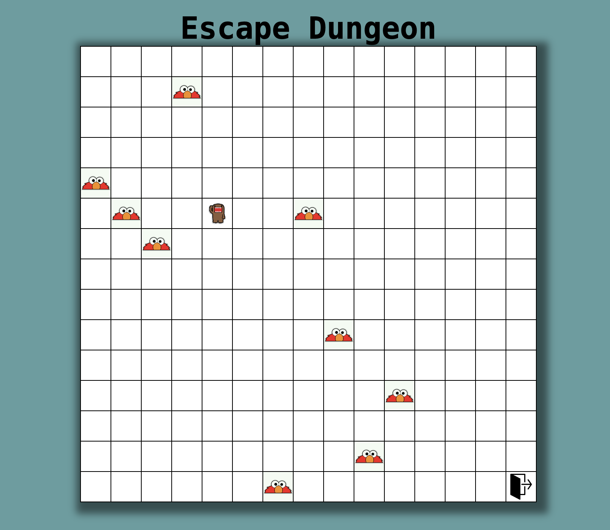

# Escape Game

## Description

This is an escape game where the player controls a character within a maze, attempting to reach the exit at the end. Random obstacles are present in the maze, and the player must navigate without colliding with these obstacles to reach the exit.

## How to Play

The player moves the character using arrow keys. When the player reaches the exit at the end of the maze, a congratulatory message is displayed, and the game resets.

- Up arrow key: Move up
- Down arrow key: Move down
- Left arrow key: Move left
- Right arrow key: Move right

## Installation

1. Clone the repository: `git clone https://github.com/username/escape-game.git`
2. Navigate to the project directory: `cd escape-game`
3. Install the necessary dependencies: `npm install` or `yarn install`
4. Start the game: `npm start` or `yarn start`

## Technologies Used

- React
- JavaScript
- CSS

## Contribution

1. Fork this repository.
2. Create a new feature branch: `git checkout -b new-feature`
3. Make your changes and commit them: `git commit -am 'Add new feature'`
4. Push your branch: `git push origin new-feature`
5. Open a pull request.

